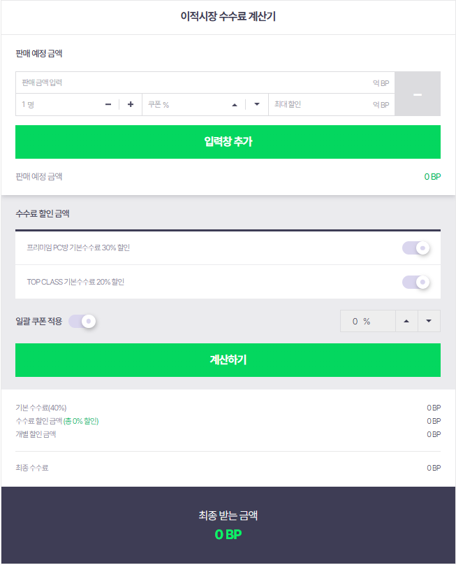

피파 공식 사이트에 있는 수수료 계산기가 너무 불편해서 직접 만든다!

현재 공식 사이트에 있는 수수료 계산기는 가격 적고 TAP을 누르면 다음 가격 탭으로 가는게 아니라,
무슨 인원? 그거랑 할인율 머시기가 나와서 TAP을 거의 4~5번을 눌러야함 그럴바엔 그냥 마우스로 누르지

그래서 내가 생각한게

이적시장을 캡쳐해서 올리면
알아서 이름과 숫자를 빼오고, 수수료 쿠폰 갯수나 그런거 적으면
비싼순으로 알아서 계산해주는거지

그러고 결과화면에서는 피파대낙 사이트 쫙 보여주고 연결해주는거지

난 괜찮은거 같은데?
